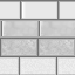

# castle grounds - documentation, information, etc.

castle grounds has begun a rework from the GROUND UP, starting from the final model. everything found has been consistent with the grid, unlike the tpp model the other rework started with.

observations :

\- the brick uv on the front of the castle was not changed between SSK and final.

\- previously an inaccurate texture was used; i am working on an updated version. attached is old (top) and new (bottom). 

note the stucco is more detailed. additionally it has been centered differently and highlights have been removed (tentative)

\- the far hills in the back of the stage, seen in c-band and gdc, were unchanged from SSK to final

\- the window color was greener than what we see in showfloor